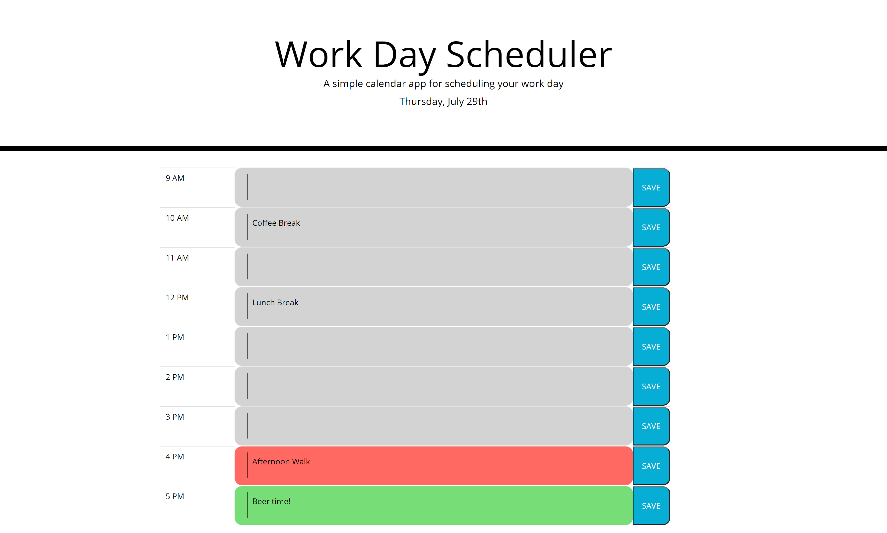

# 05-Third-Party-APIs-Work-Day-Scheduler
Work day scheduler - data stored in "local storage"

This application is a simple scheduler for the current day. It allows a user to enter taks/meetings into hourly time blocks and color codes the time block based on the current time. Once a user enters data, they can save that item by clicking the save button. Only the line associated with the save button is captured in local storage, so if they do not hit save on all lines that they entered and refresh the page, the lines that they did not click save on will be lost. Any items that they did save are recalled from local storage when the page is visited again or refreshed. (utilizes the browser local storage)

Specifications: 
* When the application is loaded, an hourly planner is displayed
* Each hour has a text field to enter tasks/meetings into the schedule and an associated save button
* When the save button is clicked, the associated text for that area is saved to local storage
* When the page is refreshed, all items that were saved persist
* A user can blank the line by deleting the contents and hitting save
* A user can enter as many meetings on various lines that they would like, but must remember to hit save for all
lines that they destire to be retained.

Screenshot: 

Links: 
* Repo - https://github.com/irv0735/05-Third-Party-APIs-Work-Day-Scheduler
* "Live" Site - https://irv0735.github.io/05-Third-Party-APIs-Work-Day-Scheduler/

